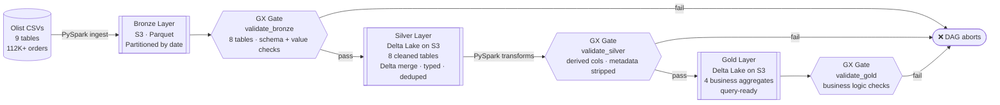

# Olist E-Commerce Lakehouse — 112K orders · 9 tables · 4 Gold aggregates

<p align="center">
  
  
  
  
  
  
  
</p>

> Production data pipeline over the real **Olist Brazilian E-Commerce dataset** (112K+ orders, 9 tables) — Bronze → Silver → Gold Medallion Architecture with PySpark, Delta Lake, Great Expectations quality gates, and AWS S3. Delivers RFM segments, seller scorecards, and sales trends in **under 12 minutes**.

---

## Data Flow



**Scale:** 112K+ orders · 9 CSV sources · 8 Silver tables · 4 Gold tables · daily schedule · 2-retry quality gates

---

## Tech Stack

| Layer | Technology |
|---|---|
| Ingestion | PySpark 3.4 — reads CSV, writes partitioned Parquet to S3 |
| Storage | AWS S3 — all three layers |
| Silver/Gold | Delta Lake 2.4 — ACID transactions, versioned writes, Delta merge |
| Data Quality | Great Expectations 0.18 — validation gates at every layer boundary |
| Orchestration | Apache Airflow 2.8 — DAG with three quality gates |
| Testing | pytest — 6 unit tests on Silver transformation logic |
| Local runtime | Docker Compose — one-command stack |

## Docker Images

| Image | Version | Purpose |
|---|---|---|
| `apache/airflow` | `2.8.1-python3.11` | Base for all Airflow services — extended by `Dockerfile.airflow` to add Java 17, PySpark, Delta Lake, GX, and pytest |
| `postgres` | `13` | Airflow metadata database |

---

## Quick Start

**Prerequisites:** Docker Desktop, an AWS account with an S3 bucket, and IAM credentials with S3 read/write access.

```bash
git clone https://github.com/pulipakav1/lakehouse.git
cd lakehouse

cp .env.example .env
# Fill in AWS_ACCESS_KEY_ID, AWS_SECRET_ACCESS_KEY, S3_BUCKET
# Generate fernet key:
#   python -c "from cryptography.fernet import Fernet; print(Fernet.generate_key().decode())"

docker-compose up --build -d
```

Airflow UI at **http://localhost:8081** — login: `admin` / `admin`

```bash
# Trigger the pipeline
docker-compose exec airflow-scheduler airflow dags trigger olist_lakehouse_pipeline

# Run unit tests
docker-compose exec airflow-scheduler bash -c "python -m pytest /opt/airflow/tests/ -v"
```

**Expected run time:** ~8–12 minutes end-to-end on a laptop.

---

## Airflow DAG

```
start → bronze_ingestion → validate_bronze → silver_transformation → validate_silver → gold_aggregation → validate_gold → end
```

| Task | What it does |
|---|---|
| `bronze_ingestion` | Reads all 9 Olist CSVs, adds metadata cols, writes partitioned Parquet to S3 |
| `validate_bronze` | GX suite — null checks, uniqueness, row count, enum membership, value ranges across 8 tables |
| `silver_transformation` | Casts types, deduplicates on natural PKs, Delta merge upsert, writes 8 tables |
| `validate_silver` | GX suite — derived cols exist, bronze metadata cols absent, value constraints |
| `gold_aggregation` | Builds 4 business aggregates, writes Delta |
| `validate_gold` | GX suite — revenue > 0, rates 0–100, segment enum |

- **Schedule:** daily at 06:00 UTC · **Retries:** 2 attempts, 5-minute delay

---

## Silver Tables (8)

| Table | Key transformations |
|---|---|
| `orders` | 5 timestamp casts · `delivery_days` · `is_late` · `order_year/month/dow` |
| `order_items` | Price/freight cast · `total_item_value` derived |
| `order_payments` | Value/installments cast · dedup on `(order_id, payment_sequential)` |
| `customers` | Dedup on `customer_id` |
| `products` | Category translation join · `category` coalesces English → Portuguese |
| `sellers` | Dedup on `seller_id` |
| `order_reviews` | Score cast to int · timestamp casts |
| `geolocation` | Lat/lng cast to double · dedup on `zip_code_prefix` |

## Gold Tables (4)

| Table | Description |
|---|---|
| `gold_sales_summary` | Daily revenue, order volume, avg order value, late-delivery rate |
| `gold_product_performance` | Revenue and ratings by product and category; revenue rank within category |
| `gold_customer_segments` | RFM segmentation — Champion, Loyal, New Customer, At Risk, Lost |
| `gold_seller_performance` | Seller scorecard — revenue, delivery speed, avg review score, late-order rate |

RFM thresholds are named constants in `utils/config.py` — adjust without touching transformation code.

---

## Incremental Loading

**Bronze** writes are partitioned by `_ingestion_date` with `partitionOverwriteMode=dynamic` — each daily run writes only its own date partition, leaving historical partitions untouched.

**Silver** uses Delta Lake's `.merge()` upsert on natural primary keys — on first run it creates the Delta table; on subsequent runs it updates changed records and inserts new ones without full rewrites.

**Gold** is a full overwrite on each run — aggregates must reflect all historical Silver data.

---

## Why Medallion Architecture?

| Layer | Purpose |
|---|---|
| **Bronze** | Raw data preserved as-is — full audit trail, replayable |
| **Silver** | Cleaned and typed — single source of truth for analysts |
| **Gold** | Business aggregations — fast, query-ready for dashboards |

Separating concerns means a bad Silver transformation never corrupts raw Bronze data, and Gold tables never expose messy intermediate logic to business users.

---

## Project Structure

```
ecommerce-lakehouse/
├── bronze/
│   └── bronze_ingestion.py        ← ingest 9 CSVs → partitioned S3 Parquet
├── silver/
│   └── silver_transformation.py   ← type-cast, dedup, Delta merge, 8 tables
├── gold/
│   └── gold_aggregation.py        ← 4 business aggregates
├── validation/
│   ├── gx_utils.py                ← shared GX runner
│   ├── bronze_validation.py       ← GX suites for Bronze layer
│   ├── silver_validation.py       ← GX suites for Silver layer
│   └── gold_validation.py         ← GX suites for Gold layer
├── tests/
│   └── test_silver.py             ← 6 pytest unit tests (no S3 required)
├── airflow/
│   └── dags/olist_pipeline.py     ← DAG definition, 8 tasks
├── utils/
│   └── config.py                  ← Spark session factory, S3 paths, RFM constants
├── data/                          ← 9 Olist CSV files (included)
├── .env.example
├── Dockerfile.airflow
└── docker-compose.yml
```

---

## Dataset

[Olist Brazilian E-Commerce](https://www.kaggle.com/datasets/olistbr/brazilian-ecommerce) — 9 CSV files, 112K+ real orders from 2016–2018, included in `data/`.

---

## License

MIT — use and modify freely.
